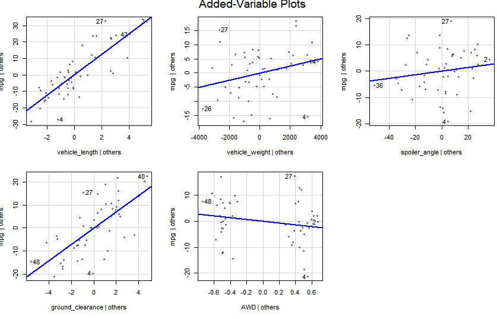
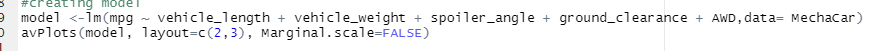
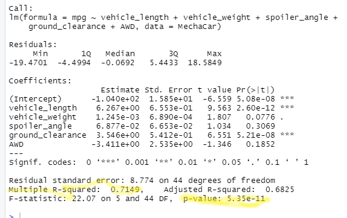
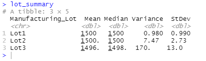
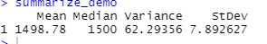
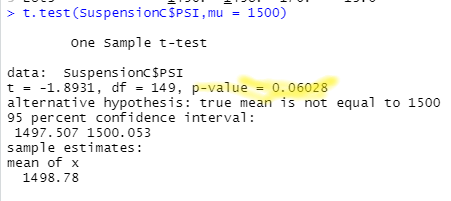
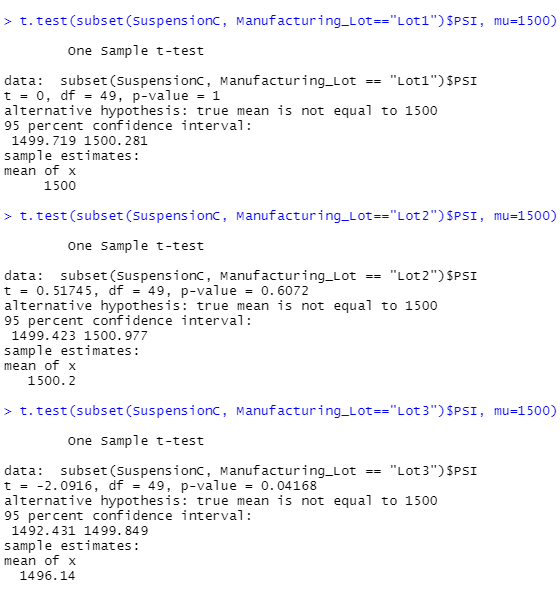

# MechaCar_Statistical_Analysis
## Linear Regression to Predict MPG
- Which variables/coefficients provided a non-random amount of variance to the mpg values in the dataset?

As seen in scatter-plots below the two variables that had the most amount of random variance are ground_clearance and vehicle_length.

code for these plots

Whereas Vehicle weight, spoiler_angle & AWD provided a non-random amount of variance.
- Is the slope of the linear model considered to be zero? Why or why not?

The slope of the linear model is not considered zero. This we can say by looking at the slope coefficients which contain significant non-zero values (variables like vehicle length, ground clearance, and AWD), and the p-values are less than the significance level of p=0.05.

- Does this linear model predict mpg of MechaCar prototypes effectively? Why or why not?

As seen in output above, our linear regression model, the r-squared value is 0.71, which means that roughly 70% of the variablilty of our dependent variable mpg is explained using this linear model, means the model does predict effectively.

## Summary Statistics on Suspension Coils

- As seen in output above lot 1 and lot2 do meet the required criteria of the variance that the suspension coils must not exceed 100 pounds per square inch. But when we look at values of lot3 where variance is 170 and Standard Dev is also large,then individually this lot does not meet the criteria.
 
As seen in output above total variance is ~62 which does fall under the design specification, so overall  current manufacturing data meets this design specification for all manufacturing lots in total.
## T-Tests on Suspension Coils
- We can see in output of t-test, that the sample mean is not statistically different from the population mean of 1500 PSI with a p-value of 0.06.
 
- However, performing t-test on individual lots show us that lot 1 & 2 do not have significant p-values, but lot 3 with p-value= 0.04 is statistically significant.

## Study Design: MechaCar vs Competition
- In the description of a statistical study that can quantify how the MechaCar performs against the competition we can think of cost, city or highway fuel efficiency, maintenance cost, or safety rating.
But as today this industry is facing revolution with the intrduction of battery cars. Therefore, thinking about a study design it would be hepful to think of **competition between MechCar and BatteryCar** Competition.
- *Null Hypothesis*: MechCars perform better in city or highway fuel efficiency, maintenance cost, or safety rating as compared to BatteryCars.

- *Alternative Hypothesis*: MechCars do not perform better in city or highway fuel efficiency, maintenance cost, or safety rating as compared to BatteryCars.
- **Statistical test**: We would start with looking at corelation coefficient between the variables. This will help us decide better which statistical test would give us better results. As, we are hypothetical guessing for now, multiple regression would help to start with. Because, this test can be performed by taking into account many variables. Also variance in the dependent variable can be accounted for in a linearcombination of independent variables.   
- Data required would be fuel and battery efficiency, maintenance cost, or safety rating, cost.